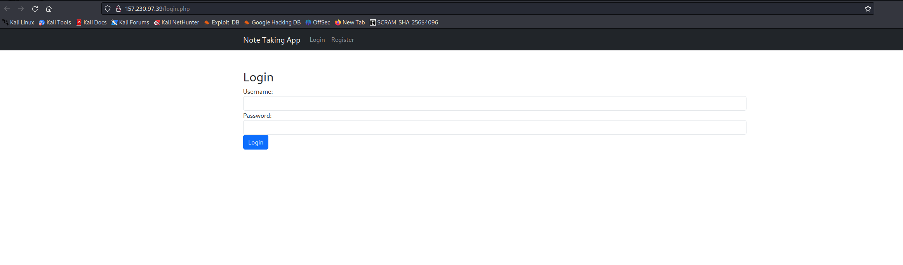
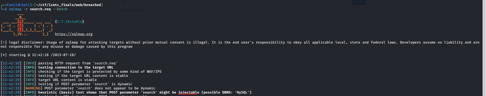
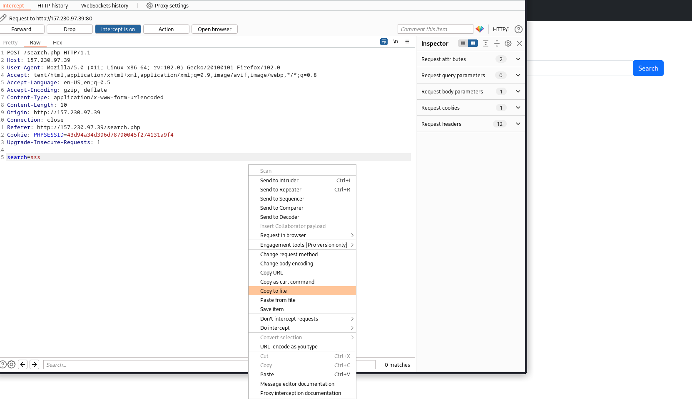

### Challenge Description :
Our admin notes were leaked recently, and we're unsure if his account was hijacked or if our database was compromised. Our developer has added protection for both cases, can you break it and leak the admin note?

At first glance after reading description, I had an intuition that it might be SQLi or some sort session hijacking , cooking stealing type of challenge...

let's take a quick look

We have a login , register , add note , delete note and search functionalities

I tried SQLi in login and register for quick wins but didn't work 

I can't see a place to submit a URL that an admin bot might visit ( XSS type of a challenge )

Let's poke around the search functionality

I like to leave smth running in the background while manually testing the page , so let's fire up sqlmap on the captured request.

you can always copy the 

