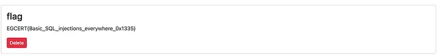

### Challenge Description :
Our admin notes were leaked recently, and we're unsure if his account was hijacked or if our database was compromised. Our developer has added protection for both cases, can you break it and leak the admin note?

At first glance after reading description, I had an intuition that it might be SQLi or some sort session hijacking , cooking stealing type of challenge...

let's take a quick look

We have a login , register , add note , delete note and search functionalities


I tried SQLi in login and register for quick wins but didn't work 

I can't see a place to submit a URL that an admin bot might visit ( XSS type of a challenge )

Let's poke around the search functionality

I like to leave smth running in the background while manually testing the page , so let's fire up sqlmap on the captured request.

you can always copy the request as shown below and supply it directly to SQLmap


And we get a hit it's injectable. 


Trying to use SQLmap to extract the database failed as the connection overwhelmed the server, Simply trying basic payload 
```
‘) or 1=1 — -
```
Or you could use the Poc payload given by sqlmap

(Screen shot taken from other write-up as the challenge is currently down.) 
 

I believe the challenge behaviour was un-intended, we were suppossed to manually extract the flag from the database and bypass a some filteration , Here's my explanation to what is happening in the backend:

- The search functionality searches the notes across the application

- We can assume that the backend query with something like ``` Select cloumn from table_name where column LIKE {our input}  ```

- The fact that the flag is in the current table and is the first entry in the table made this un-intended solution possible , I believe the creators should have added atleast one entry ( one extra note ) then added the flag note.
